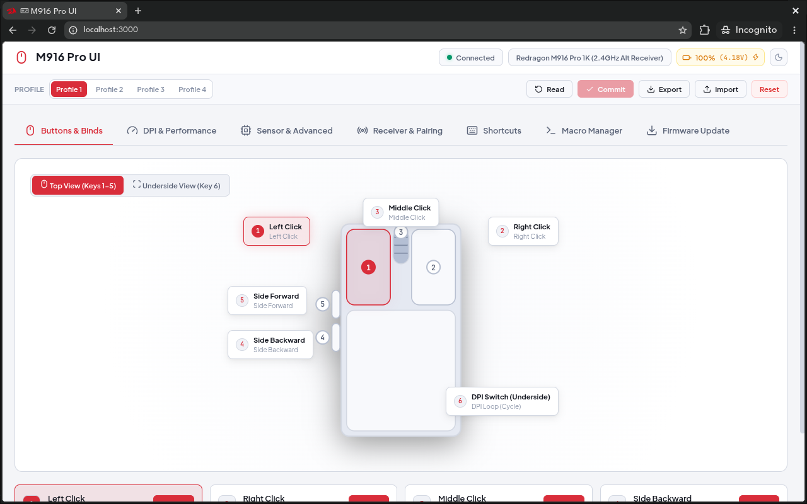
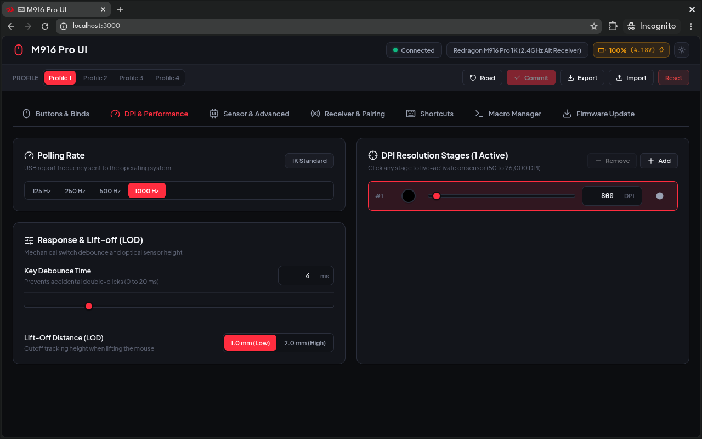

# M916 Pro UI

WebHID control center for the Redragon M916 Pro gaming mouse (1K and 4K)

<p align="center">
  
  
</p>

## Features

- **Button mapping:** Rebind any of the six hardware buttons to mouse actions, DPI switching, rapid fire, multimedia keys, shortcuts or macros
- **DPI & polling:** 1-8 DPI stages (50-26,000 DPI) with per-stage colors, live stage switching, polling rate from 125 Hz to 4 kHz
- **Sensor tuning:** Motion sync, ripple control, angle snapping, PAW3395 surface calibration (MTK)
- **Power & RF:** Long-range mode, power saving, sleep timers
- **Macros & shortcuts:** Key-combo and multi-step macro recording stored on on-board flash
- **Profiles:** 4 on-device profiles, `.json` export/import, factory reset
- **Firmware:** USB DFU updates for mouse and receiver with header validation and a dry-run trace
- **Zero install:** Static HTML/JS/CSS, no build step

## Web

Use directly in any Chromium-based browser (Chrome, Edge, Brave):

[vzpyr.github.io/m916proui](https://vzpyr.github.io/m916proui)

## Permissions

Allow the WebHID device prompt when clicking Connect. On Linux, create a udev rule so the browser can open the HID interface (WebHID uses hidraw), then replug the device:

```bash
sudo tee /etc/udev/rules.d/99-m916-pro.rules <<'EOF'
SUBSYSTEM=="hidraw", ATTRS{idVendor}=="3554", MODE="0666"
EOF
sudo udevadm control --reload-rules
```

## References

- [SPEC.md](SPEC.md) - wire protocol and on-board flash layout, reverse-engineered from the official Windows driver

## License

MIT
